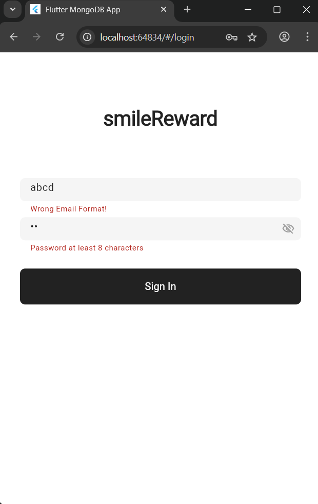
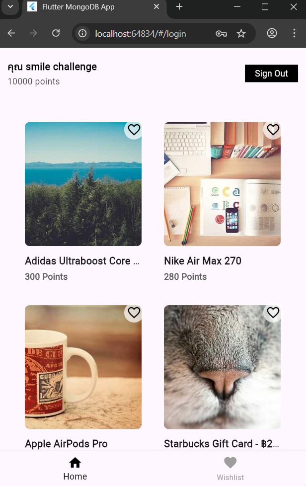
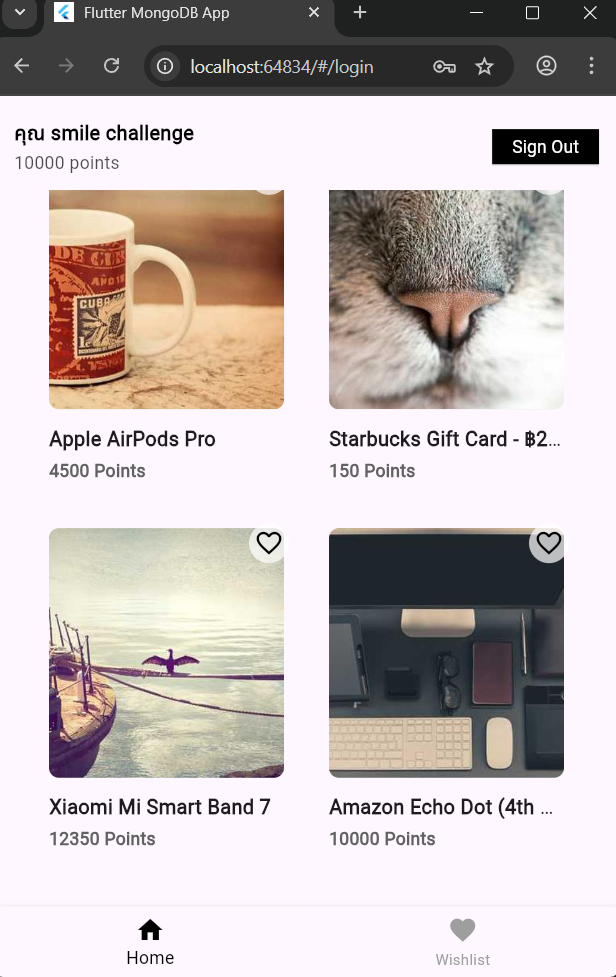
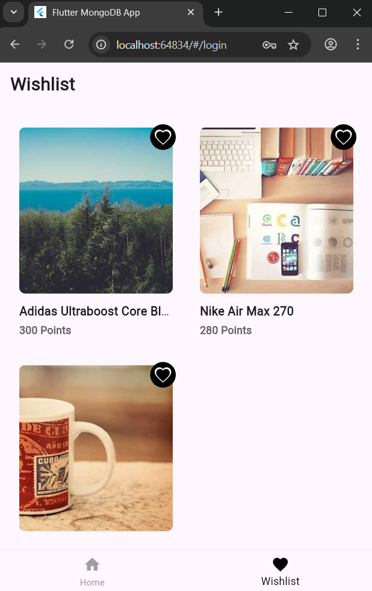
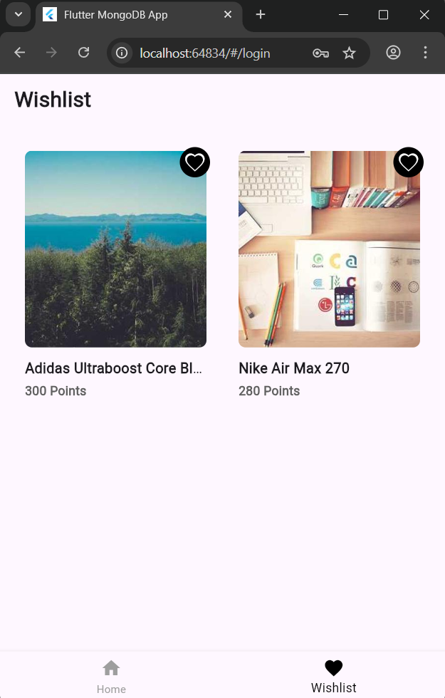
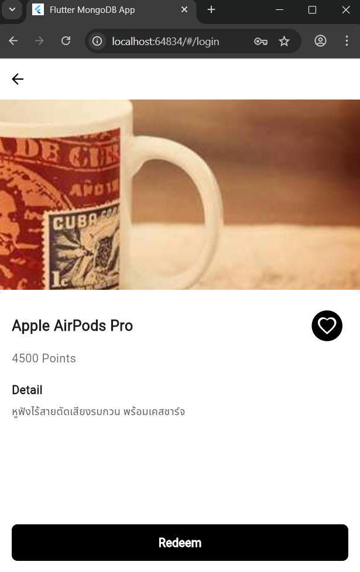
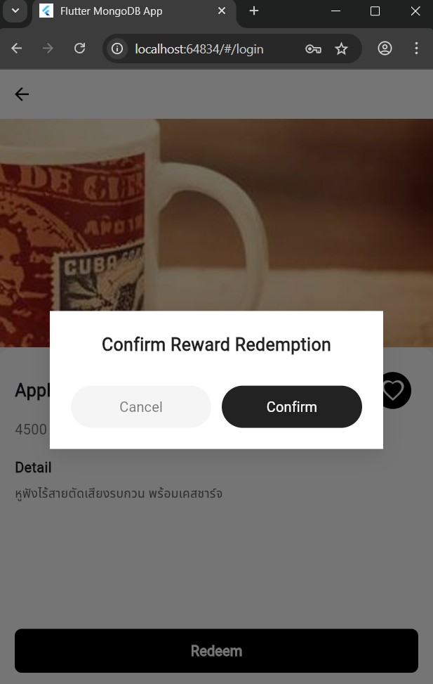
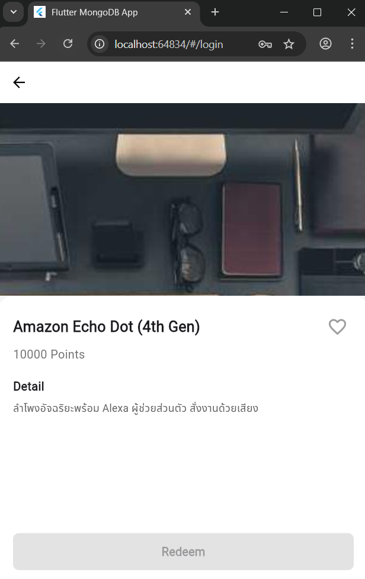

# Smile Fokus Assignment 1

> แอปพลิเคชันทดสอบระบบ Wishlist, Redeem, Login และระบบแต้ม ด้วย Flutter

---

## 1. Check format email and password

**Result:** ตรวจสอบรูปแบบอีเมลและรหัสผ่าน พร้อมแสดงข้อความแจ้งเตือน



---

## 2. Homepage

**หน้าแรกของระบบ - แสดงข้อมูลผู้ใช้และแต้มสะสม**




---

## 3. Wishlist

**แสดงรายการที่ถูกกดหัวใจ**



---

### 3.1 Remove Wishlist

**ลบรายการที่เคยถูกใจออกจากรายการ**



---

## 4. Redeem

**ก่อนแลกของรางวัล - คะแนนมี 10,000 คะแนน**




---

### 4.1 Point Not Enough for Reward

**กรณีแต้มไม่พอแลกของรางวัล**



---

## 5. Result After Redeem Reward

**หลังแลกของรางวัลเรียบร้อย - คะแนนคงเหลือ 5,500**


---


## ติดตั้งโปรเจกต์

1. ติดตั้ง Flutter SDK (ถ้ายังไม่มี) → https://docs.flutter.dev/get-started/install

2. Clone โปรเจกต์นี้:

```bash
git clone https://github.com/Tanaphatcsb64kmutnb/SMFTEST1FRONTEND.git
cd SMFTEST1FRONTEND
```


3.
ติดตั้ง dependencies ที่ใช้ในโปรเจกต์:
```bash
flutter pub get
```

4.Run project
```bash
flutter run
```